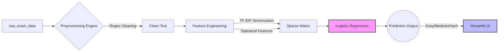

# Intelligent-Exam-Question-Level-Analysis 🎓


-success)

## Executive Summary
Traditional exam question formulation relies heavily on manual assessment, which is highly subjective, time-consuming, and prone to significant scaling limitations. The **Intelligent Exam Question Analyzer** shifts the paradigm from manual review to AI-driven evaluation. By leveraging Classical Machine Learning techniques on rich textual and statistical abstractions, this system instantaneously predicts the cognitive difficulty (Easy, Medium, Hard) of any given exam question, ensuring consistent and standardized assessments across diverse academic domains.

## System Architecture



## Key Features

* **Zero-Shot Inference:** The underlying Machine Learning pipeline dynamically extracts feature intelligence (TF-IDF vector combinations and character/word statistics) to instantly classify novel, unseen questions without relying on data leakage.
* **Bloom's Taxonomy Alignment:** The models have indirectly learned structural relationships inherent to cognitive frameworks mapped inside the foundational dataset.
* **Real-Time Classification:** A highly optimized Streamlit UI runs local inference through pre-compiled model artifacts (`.pkl` dumps) in milliseconds to serve predictions and confidence scores immediately.

## Dataset Branding
The system is modeled against the foundational **`raw_exam_data.csv`**. 
This rich dataset contains **6,200 rows** across **6 meticulously curated columns**:
1. `Question_Text` (The primary text feature)
2. `Subject_Domain` (e.g., Physics, Computer Science, Mathematics)
3. `Topic_Subdomain`
4. `Bloom_Taxonomy` (Cognitive Depth)
5. `Historical_Pass_Rate` 
6. `Difficulty_Level` (Target Variable: Easy, Medium, Hard)

## Installation Guide

Follow these steps to set up the robust inference engine on your local machine.

```bash
# 1. Clone the repository
git clone https://github.com/IAmNishantSingh/Intelligent-Exam-Question-Level-Analysis.git
cd Intelligent-Exam-Question-Level-Analysis

# 2. Create a virtual environment (Recommended)
python3 -m venv venv
source venv/bin/activate  # On Windows use: venv\Scripts\activate

# 3. Install the specific pipeline dependencies
pip install -r requirements.txt
# (Core dependencies: streamlit, pandas, scikit-learn, xgboost, imbalanced-learn, joblib)

# 4. Launch the application
streamlit run app.py
```
*Note: Make sure the `artifacts/` folder (containing the compiled vectorizers, scalers, and the best model) is present in the root directory before launching.*

## Model Performance

The core prediction engine evaluates the textual complexity through heavily engineered sparse matrices. Multiple algorithms were benchmarked for optimal performance on the validation strata.

| Machine Learning Model | Execution Paradigm | Accuracy Engine Metric |
| :--- | :--- | :--- |
| **Logistic Regression** 🏆 | Champion Pipeline | **71.00%** |
| XGBoost | Gradient Boosting | 54.50% |
| Random Forest | Bagging Ensemble | 51.75% |

*(Note: Target imbalance was handled mathematically during training via SMOTE technique upsampling).*

## Future Scope

While the current operational pipeline excels at static text classification, the architectural roadmap includes deep integrations with advanced Large Language Models (LLMs) like GPT-4. This strategic expansion will evolve the system from merely *analyzing* the cognitive difficulty of existing prompts to autonomously *generating* mathematically sound and domain-specific questions perfectly calibrated to requested difficulty distributions.

## Team Structure & Contributors

* **Nishant Ranjan Singh [2401010301]** - *GitHub repository management, Data preprocessing, Streamlit web application development, and
Project report preparation.*
* **Atanu Adhakri [2401010111]** - *Synthetic Dataset Creation, Data Preprocessing, TF-IDF, Model Training, and Streamlit web application
development*
* **Sambhav Kumar [2401010409]** - *PPT, Data Preprocessing, testing, and project report preparation.*
* **Prince Singh [2401010353]** - *Exploratory Data Analysis, Feature optimization, testing, and  project report preparation.*

---

<p align="center">
  <i>Developed to optimize educational frameworks through Machine Learning.</i>
</p>
