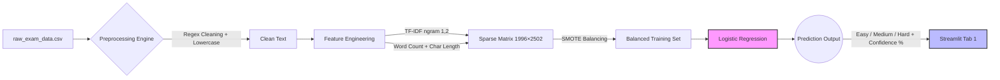
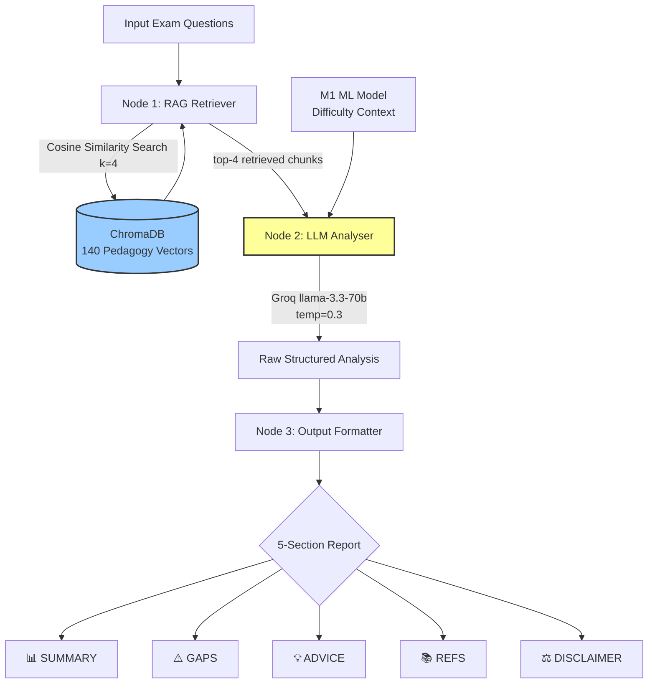

# Intelligent-Exam-Question-Level-Analysis 🎓


---

## Executive Summary

Traditional exam question formulation relies heavily on manual assessment — a process that is inherently subjective, time-consuming, and impossible to scale. The **Intelligent Exam Question Analyser** replaces manual review with a two-phase AI pipeline:

- **Milestone 1** applies classical Machine Learning (TF-IDF + SMOTE + Logistic Regression) to instantly predict the cognitive difficulty of any exam question as **Easy**, **Medium**, or **Hard**, achieving 71% macro accuracy.
- **Milestone 2** extends the system into a fully autonomous **Agentic AI Assessment Designer** — a three-node LangGraph state machine that retrieves verified pedagogical knowledge from a ChromaDB RAG knowledge base (Bloom's Taxonomy + Assessment Guidelines) and uses the **Groq llama-3.3-70b-versatile** LLM to generate structured five-section improvement reports.

Both milestones are deployed as a single, publicly accessible **Streamlit application** with a professional dark-academic UI.

> **Live App:** [intelligent-exam-question-level-analysis.streamlit.app](https://intelligent-exam-question-level-analysis.streamlit.app)
> **Repository:** [IAmNishantSingh/Intelligent-Exam-Question-Level-Analysis](https://github.com/IAmNishantSingh/Intelligent-Exam-Question-Level-Analysis)

---

## Table of Contents

1. [System Architecture](#system-architecture)
2. [Milestone 1 — ML Pipeline](#milestone-1--ml-pipeline)
3. [Milestone 2 — Agentic Assessment Designer](#milestone-2--agentic-assessment-designer)
4. [Agent Workflow Documentation](#agent-workflow-documentation)
5. [Dataset](#dataset)
6. [Model Performance](#model-performance)
7. [Project Structure](#project-structure)
8. [Installation Guide](#installation-guide)
9. [Environment Variables](#environment-variables)
10. [Team Structure & Contributors](#team-structure--contributors)

---

## System Architecture

The system is composed of two tightly integrated subsystems connected through a unified Streamlit interface.

### High-Level Architecture

```
┌─────────────────────────────────────────────────────────────────────┐
│                     Streamlit Application (app.py)                  │
│                                                                     │
│  ┌───────────────────────────┐  ┌──────────────────────────────┐   │
│  │   Tab 1 — Milestone 1     │  │   Tab 2 — Milestone 2        │   │
│  │   ML Difficulty Predictor │  │   Agentic Assessment Designer│   │
│  └───────────────────────────┘  └──────────────────────────────┘   │
└─────────────────────────────────────────────────────────────────────┘
         │                                      │
         ▼                                      ▼
┌─────────────────────┐             ┌───────────────────────────────┐
│  ML Inference Engine│             │   LangGraph State Machine     │
│                     │             │                               │
│  raw_exam_data.csv  │             │  ┌────────────────────────┐   │
│        │            │             │  │  Node 1: RAG Retriever │   │
│        ▼            │             │  │  (ChromaDB + MiniLM)   │   │
│  Text Preprocessing │             │  └──────────┬─────────────┘   │
│  (Regex + Lowercase)│             │             │ top-4 chunks     │
│        │            │             │  ┌──────────▼─────────────┐   │
│        ▼            │             │  │  Node 2: LLM Analyser  │   │
│  TF-IDF Vectorizer  │             │  │  (Groq llama-3.3-70b)  │   │
│  + Numeric Features │◄────────────┤  └──────────┬─────────────┘   │
│  (Word/Char Count)  │  M1 assists │             │ raw analysis     │
│        │            │  M2 context │  ┌──────────▼─────────────┐   │
│        ▼            │             │  │  Node 3: Output        │   │
│  Logistic Regression│             │  │  Formatter             │   │
│  (best_model.pkl)   │             │  └──────────┬─────────────┘   │
│        │            │             │             │                  │
│        ▼            │             │  5-Section Structured Report   │
│  Easy/Medium/Hard   │             │  (Summary · Gaps · Advice ·   │
│  + Confidence Score │             │   Refs · Disclaimer)          │
└─────────────────────┘             └───────────────────────────────┘
```

### Milestone 1 — ML Pipeline Architecture


```mermaid
graph LR
    A[raw_exam_data.csv] --> B{Preprocessing Engine}
    B -->|Regex Cleaning + Lowercase| C[Clean Text]
    C --> D[Feature Engineering]
    D -->|TF-IDF ngram 1,2| E[Sparse Matrix 1996×2502]
    D -->|Word Count + Char Length| E
    E -->|SMOTE Balancing| F[Balanced Training Set]
    F --> G[Logistic Regression]
    G --> H((Prediction Output))
    H -->|Easy / Medium / Hard + Confidence %| I[Streamlit Tab 1]
    style G fill:#f9f,stroke:#333,stroke-width:2px
    style I fill:#bbf,stroke:#333,stroke-width:2px
```

### Milestone 2 — Agentic Pipeline Architecture


```mermaid
graph TD
    A[Input Exam Questions] --> B[Node 1: RAG Retriever]
    B -->|Cosine Similarity Search k=4| C[(ChromaDB\n140 Pedagogy Vectors)]
    C --> B
    B -->|top-4 retrieved chunks| D[Node 2: LLM Analyser]
    M1[M1 ML Model\nDifficulty Context] --> D
    D -->|Groq llama-3.3-70b\ntemp=0.3| E[Raw Structured Analysis]
    E --> F[Node 3: Output Formatter]
    F --> G{5-Section Report}
    G --> G1[📊 SUMMARY]
    G --> G2[⚠️ GAPS]
    G --> G3[💡 ADVICE]
    G --> G4[📚 REFS]
    G --> G5[⚖️ DISCLAIMER]
    style D fill:#ff9,stroke:#333,stroke-width:2px
    style C fill:#9cf,stroke:#333,stroke-width:2px
```

---

## Milestone 1 — ML Pipeline

### Feature Engineering

A sparse feature matrix **X ∈ ℝ^(1996×2502)** is constructed by horizontal stacking of two feature groups:

| Feature Group | Method | Dimensions |
| :--- | :--- | :--- |
| Text Features | TF-IDF with `ngram_range=(1,2)` | ~2500 sparse columns |
| Numeric Features | Word count + Character length, StandardScaler normalized | 2 columns |

### Text Preprocessing (`clean_text`)

1. Lowercase conversion
2. HTML tag stripping via regex `<[^>]+>`
3. Removal of all non-alphanumeric characters
4. Whitespace normalization

### Class Imbalance Handling

SMOTE (Synthetic Minority Over-sampling Technique) is applied **after** the train/test split to prevent label leakage. Synthetic minority samples are generated by linear interpolation in TF-IDF feature space.

### Artifacts

All compiled artifacts are stored in the `artifacts/` directory:

| File | Contents |
| :--- | :--- |
| `vectorizer.pkl` | Fitted TF-IDF vectorizer |
| `scaler.pkl` | Fitted StandardScaler for numeric features |
| `encoder.pkl` | Fitted LabelEncoder (Easy / Medium / Hard) |
| `best_model.pkl` | Champion Logistic Regression model |

---

## Milestone 2 — Agentic Assessment Designer

### Knowledge Base

Two pedagogical PDFs (Bloom's Taxonomy + Assessment Design Guidelines) are chunked and embedded using `sentence-transformers/all-MiniLM-L6-v2` (384-dimensional embeddings) into a **ChromaDB** persistent vector store containing **140 vector objects** in the `pedagogy_kb` collection.

### LLM Configuration

| Parameter | Value |
| :--- | :--- |
| Provider | Groq (free-tier) |
| Model | `llama-3.3-70b-versatile` |
| Temperature | `0.3` (controlled, factual output) |
| RAG retrieval k | 4 top chunks |

### Typed Agent State

```python
class AssessmentState(TypedDict):
    exam_questions : List[str]   # Input questions from user
    retrieved_docs : List[str]   # ChromaDB retrieved pedagogy chunks
    analysis       : str         # Raw LLM output (unparsed)
    summary        : str         # Extracted overall quality summary
    gaps           : str         # Identified Bloom's taxonomy gaps
    advice         : str         # Specific improvement recommendations
    refs           : str         # Pedagogical references cited
    disclaimer     : str         # Ethical and educational notices
```

---

## Agent Workflow Documentation

### Node Definitions

The LangGraph state machine consists of three sequential nodes compiled into a directed acyclic graph (DAG):

```
[START] → rag_retriever_node → llm_analyser_node → output_formatter_node → [END]
```

---

#### Node 1: `rag_retriever_node`

**Responsibility:** Retrieve the most relevant pedagogical context from ChromaDB.

**Inputs from state:** `exam_questions`

**Process:**
1. Concatenates all input exam questions into a single combined query string.
2. Invokes the ChromaDB retriever with `search_type="similarity"` and `k=4`.
3. Returns the `page_content` of the top-4 most semantically similar document chunks (cosine similarity in 384-dim MiniLM embedding space).

**Outputs to state:** `retrieved_docs` (List of 4 text chunks)

**Sidebar indicator:** Sets `steps_completed = ["rag_retriever"]`

---

#### Node 2: `llm_analyser_node`

**Responsibility:** Combine retrieved context with M1 ML prediction and invoke the Groq LLM to produce a structured analysis.

**Inputs from state:** `exam_questions`, `retrieved_docs`

**Process:**
1. Joins `retrieved_docs` into a single `context` string.
2. Formats `exam_questions` as a numbered list.
3. **M1 Integration:** Runs the input questions through the Milestone 1 ML pipeline (TF-IDF transform → StandardScaler → Logistic Regression) to obtain a difficulty label, which is injected into the LLM prompt as additional context.
4. Constructs a structured prompt instructing the LLM to produce output in exactly five labeled sections: `SUMMARY`, `GAPS`, `ADVICE`, `REFS`, `DISCLAIMER`.
5. Invokes `ChatGroq` (llama-3.3-70b-versatile, temperature=0.3) with the prompt.
6. Includes a hallucination guard: the prompt explicitly instructs the LLM to state insufficiency in the GAPS section rather than fabricate information.

**Outputs to state:** `analysis` (raw LLM response string)

**Sidebar indicator:** Sets `steps_completed = ["rag_retriever", "llm_analyser"]`

---

#### Node 3: `output_formatter_node`

**Responsibility:** Parse the raw LLM output into five distinct structured sections.

**Inputs from state:** `analysis`

**Process:**
1. Implements a `extract_section(text, section)` function that locates each section header (e.g., `SUMMARY:`) and extracts content up to the next section header.
2. Handles missing sections gracefully by returning `"Not available."` on `ValueError`.
3. Populates all five output keys in the state dictionary.

**Outputs to state:** `summary`, `gaps`, `advice`, `refs`, `disclaimer`

**Sidebar indicator:** Sets `steps_completed = ["rag_retriever", "llm_analyser", "output_formatter"]`

---

### Graph Compilation

```python
graph_builder = StateGraph(AssessmentState)
graph_builder.add_node("rag_retriever",    rag_retriever_node)
graph_builder.add_node("llm_analyser",     llm_analyser_node)
graph_builder.add_node("output_formatter", output_formatter_node)
graph_builder.set_entry_point("rag_retriever")
graph_builder.add_edge("rag_retriever",    "llm_analyser")
graph_builder.add_edge("llm_analyser",     "output_formatter")
graph_builder.add_edge("output_formatter", END)
agent = graph_builder.compile()   # cached via @st.cache_resource
```

### Input Modes

The Milestone 2 tab supports two question input modes:

| Mode | Description |
| :--- | :--- |
| **Type manually** | User enters questions one per line in a text area; questions are split on newlines. |
| **Load from dataset CSV** | User specifies a CSV path (default: `Dataset/raw_exam_data.csv`) and selects a sample size (3–20 questions) via a slider; questions are randomly sampled from the `Question_Text` column. |

### Output Report Structure

The agent produces a downloadable `.txt` report with five sections rendered in dedicated Streamlit tabs:

| Tab | Section | Content |
| :--- | :--- | :--- |
| 📊 Summary | `SUMMARY` | Overall quality and Bloom's level distribution of the submitted questions |
| ⚠️ Gaps | `GAPS` | Missing cognitive levels, underrepresented Bloom's verbs, and coverage weaknesses |
| 💡 Advice | `ADVICE` | Question-by-question improvement suggestions with revised phrasing examples |
| 📚 References | `REFS` | Specific pedagogy guidelines and Bloom's taxonomy categories referenced |
| ⚖️ Disclaimer | `DISCLAIMER` | Ethical notice: AI-generated, requires human-in-the-loop validation |

---

## Dataset

The system is trained on **`raw_exam_data.csv`**, a synthetic dataset spanning Physics, Computer Science, and Mathematics.

| Property | Value |
| :--- | :--- |
| Raw rows | 6,200 |
| Post-cleaning (unique) | 1,996 |
| Columns | 6 |
| Target variable | `Difficulty_Level` (Easy / Medium / Hard) |

**Columns:**

1. `Question_Text` — Primary text feature
2. `Subject_Domain` — e.g., Physics, Computer Science, Mathematics
3. `Topic_Subdomain` — Sub-topic within domain
4. `Bloom_Taxonomy` — Cognitive depth label (Levels 1–6)
5. `Historical_Pass_Rate` — Numerical pass rate statistic
6. `Difficulty_Level` — Target: Easy / Medium / Hard

**Class distribution (pre-SMOTE):**

| Class | Count |
| :--- | :--- |
| Easy | 820 |
| Medium | 736 |
| Hard | 440 |

---

## Model Performance

Three classifiers were benchmarked on a held-out validation stratum after SMOTE balancing on the training split:

| Model | Macro Accuracy | Configuration | Verdict |
| :--- | :--- | :--- | :--- |
| **Logistic Regression** 🏆 | **71.00%** | `max_iter=1000, C=1.0` | Champion |
| XGBoost | 54.50% | `eval_metric=mlogloss` | Runner-up |
| Random Forest | 51.75% | `n_estimators=100` | Baseline |

**Champion model per-class metrics (Logistic Regression):**

| Class | Precision | Recall | F1-Score |
| :--- | :--- | :--- | :--- |
| Easy | 0.78 | 0.76 | 0.77 |
| Medium | 0.72 | 0.68 | 0.70 |
| Hard | 0.61 | 0.64 | 0.62 |

Logistic Regression's linear decision boundaries align naturally with TF-IDF's vocabulary-level class separability, where high-signal Bloom's action verbs ("synthesise", "hypothesise", "evaluate") provide strong linear discriminants.

---

## Project Structure

```
Intelligent-Exam-Question-Level-Analysis/
│
├── app.py                          # Unified Streamlit application (M1 + M2)
│
├── artifacts/                      # Compiled ML model artifacts
│   ├── best_model.pkl              # Champion Logistic Regression model
│   ├── vectorizer.pkl              # Fitted TF-IDF vectorizer
│   ├── scaler.pkl                  # Fitted StandardScaler
│   └── encoder.pkl                 # Fitted LabelEncoder
│
├── chroma_db/                      # ChromaDB persistent vector store
│   └── chroma.sqlite3              # 140 pedagogy vectors (MiniLM embeddings)
│
├── Dataset/
│   └── raw_exam_data.csv           # Primary training corpus (6,200 rows)
│
├── milestone1.ipynb                # M1: EDA, feature engineering, model training
├── milestone2_agent.ipynb          # M2: RAG ingestion, LangGraph agent build
│
├── requirements.txt                # Python dependencies
├── .env                            # Environment variables (GROQ_API_KEY) — not committed
└── README.md                       # This file
```

---

## Installation Guide

```bash
# 1. Clone the repository
git clone https://github.com/IAmNishantSingh/Intelligent-Exam-Question-Level-Analysis.git
cd Intelligent-Exam-Question-Level-Analysis

# 2. Create a virtual environment (recommended)
python3 -m venv venv
source venv/bin/activate        # Windows: venv\Scripts\activate

# 3. Install dependencies
pip install -r requirements.txt

# 4. Configure environment variables
cp .env.example .env            # then add your GROQ_API_KEY (see below)

# 5. Launch the application
streamlit run app.py
```

> **Note:** Ensure the `artifacts/` folder (containing `.pkl` files) and the `chroma_db/` folder are present in the root directory before launching. Without these, M1 predictions and M2 agent will not load.

---

## Environment Variables

Create a `.env` file in the project root:

```env
GROQ_API_KEY=your_groq_api_key_here
```

Obtain a free Groq API key at [console.groq.com](https://console.groq.com). The application uses the `python-dotenv` library to load this at startup via `load_dotenv()`.

---

## Key Design Decisions

**Hallucination mitigation:** The M2 LLM prompt explicitly instructs the model to acknowledge insufficient context in the GAPS section rather than fabricate pedagogical advice. ChromaDB RAG grounds all LLM output in verified Bloom's Taxonomy and Assessment Guideline sources.

**M1 × M2 integration:** The LLM analyser node internally invokes the M1 ML pipeline on the submitted questions and injects the predicted difficulty label into the LLM prompt as auxiliary context, bridging both milestones within a single agent call.

**NumPy 2.0 compatibility:** A monkey-patch (`np.float_ = np.float64`, `np.int_ = np.int64`) is applied at the very top of `app.py` before any imports to ensure compatibility between scikit-learn `.pkl` artifacts compiled under older NumPy and newer runtime environments.

**Stateless design:** The agent holds no memory across sessions. Each invocation of `agent.invoke(initial_state)` begins from a clean `AssessmentState`. This is intentional for privacy and reproducibility.

---

## Future Scope

- **Longitudinal tracking:** Session-persistent state to track question quality improvements over time.
- **LLM-powered question generation:** Evolve from *analyzing* difficulty to autonomously *generating* questions calibrated to a target Bloom's level distribution.
- **Humanities domain expansion:** Extend the training corpus beyond STEM to reduce domain-specificity bias.
- **Multi-modal input:** Support image-based questions (diagrams, graphs) via vision-language models.

---

## Ethics & Responsible AI

- **Bias mitigation:** SMOTE ensures equitable model performance across all three difficulty classes during training.
- **Transparency:** Every M2 report includes a mandatory DISCLAIMER section enforcing human-in-the-loop review.
- **Grounding:** RAG retrieval anchors all LLM outputs in verified pedagogical sources, reducing hallucination risk.
- **Zero data persistence:** No user-submitted questions or generated reports are stored server-side.
- **Free-tier only:** The system operates entirely within free-tier API constraints (Groq, HuggingFace), ensuring open accessibility.

---

## Team Structure & Contributors

| Team Member | Enrollment No. | M1 Contributions | M2 Contributions |
| :--- | :--- | :--- | :--- |
| **Nishant Ranjan Singh** | 2401010301 | Repository management, system integration, Streamlit UI/UX | LangGraph orchestration, cloud deployment, LaTeX report |
| **Atanu Adhikari** | 2401010111 | Synthetic dataset creation, TF-IDF, SMOTE, hyperparameter tuning | ChromaDB RAG foundation, PDF ingestion pipeline |
| **Sambhav Kumar** | 2401010409 | Presentation design, QA on preprocessing, abstract writing | Agentic workflow validation, end-to-end system testing |
| **Prince Singh** | 2401010353 | EDA, bigram feature optimisation, word-count correlations | Agent output quality testing, pedagogical reference verification |

---

<p align="center">
  <i>Developed to optimize educational frameworks through Machine Learning and Agentic AI.</i><br>
  <i>GenAI Capstone Project — Milestone 1 + Milestone 2 · April 2026</i>
</p>
